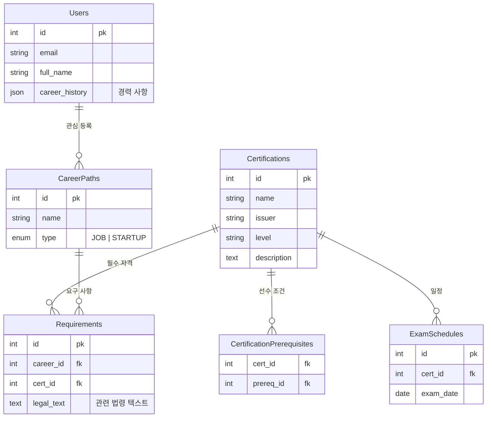

# 시스템 설계 문서 (System Design Document)

**프로젝트명**: 자격증 네비게이션 & 커리어 시뮬레이터  
**버전**: 1.0  
**작성일**: 2025-12-25  

## 1. 개요 (Overview)

### 1.1 프로젝트 비전
본 프로젝트는 단순한 자격증 정보 제공을 넘어, 사용자 상태(나이, 경력, 목표)에 기반한 **'최적의 커리어 로드맵'**을 제시하는 AI 기반 플랫폼입니다. 방대한 자격증 데이터와 법적 요건(선임 기준 등)을 연결하여 시각화된 **Tech-Tree**를 제공하고, 생성형 AI(LLM)를 통해 개인화된 진로 상담을 제공합니다.

### 1.2 핵심 가치
- **Data-Driven**: 데이터(법령, 기술 자격)에 근거한 정확한 커리어 설계.
- **Visual Navigation**: 게임 스킬 트리 형태의 직관적인 UI 경험.
- **AI-Powered**: 정적 데이터 검색을 넘어선 능동적인 컨설팅.

---

## 2. 시스템 아키텍처 (System Architecture)

전체 시스템은 **MSA(Microservices Architecture)** 지향의 모듈형 구조를 따르며, 초기 단계는 모놀리식으로 시작하되 확장이 용이하도록 설계되었습니다.

### 2.1 아키텍처 다이어그램
```mermaid
graph TD
    User[사용자 (PC/Mobile)] -->|HTTPS| CDN[Vercel Edge Network]
    CDN --> Frontend[Next.js Frontend]
    
    Frontend -->|API Request| BackendLB[Load Balancer]
    BackendLB --> Backend[FastAPI Backend Server]
    
    subgraph Data Layer
        Backend --> Postgres[(PostgreSQL: Main DB)]
        Backend --> Redis[(Redis: Cache & Queue)]
        Backend --> VectorDB[(Vector DB: RAG Search)]
    end
    
    subgraph AI Layer
        Backend --> LLM_Interface[LLM Interface Layer]
        LLM_Interface --> OpenAI[OpenAI / Claude API]
    end
    
    subgraph External
        Backend --> QNet[Q-Net API]
        Backend --> LawAPI[국가법령정보센터 API]
    end
```

### 2.2 기술 스택 선정 이유
| 구성 요소 | 기술 스택 | 선정 이유 |
| :--- | :--- | :--- |
| **Frontend** | Next.js (React) | SEO 최적화 필수 (정보성 사이트), Vercel을 통한 손쉬운 배포, React Ecosystem. |
| **Backend** | Python FastAPI | 비동기 처리(Async IO)로 고성능, AI/LLM 라이브러리(LangChain 등) 사용 최적화. |
| **Database** | PostgreSQL | 관계형 데이터(자격증, 사용자)의 무결성 보장. JSONB 지원으로 유연성 확보. |
| **Cache** | Redis | 반복되는 API 호출(테크트리 데이터 등) 캐싱, Celery 작업 큐 브로커. |
| **Search/AI** | PGVector / Pinecone | 법령 및 자격증 요건에 대한 시맨틱 검색(RAG) 구현. |

---

## 3. 데이터 아키텍처 (Data Architecture)

### 3.1 ER 다이어그램 (ERD)
자격증 간의 관계(Prerequisite)와 법적 요건(Requirement)이 데이터 모델의 핵심입니다.



### 3.2 벡터 데이터 전략 (RAG)
- **대상 데이터**: 자격증 관련 법령(전기사업법 등), 자격요건 텍스트.
- **임베딩 모델**: `text-embedding-3-small` (OpenAI) 또는 HuggingFace 오픈소스 모델.
- **저장소**: 초기에는 PostgreSQL의 `pgvector` 확장을 사용하여 관리 포인트 최소화.

---

## 4. 로드맵 및 단계별 구현 계획 (Roadmap)

프로젝트는 MVP에서 시작하여 고도화된 AI 플랫폼으로 진화합니다.

### Phase 1: MVP (기반 구축 & 시각화) - **현재 단계**
- **목표**: 핵심 데이터 구조화 및 테크트리 시각화 구현.
- **주요 기능**:
    - 자격증 Node/Edge 데이터베이스 설계.
    - React Flow 기반의 대화형 테크트리 UI.
    - 관리자용 간단한 데이터 입력(CRUD) 시스템.
    - 회원가입 없이 탐색 가능한 공개 뷰.

### Phase 2: 데이터 파이프라인 & 확장 (Data Intelligence)
- **목표**: 공공 데이터를 통한 자동 업데이트 체계 구축.
- **주요 기능**:
    - **Q-Net OpenAPI 연동**: 자격증 일정, 수수료, 합격률 정보 자동 동기화.
    - **법령 데이터 크롤러**: 국가법령정보센터 API를 통해 자격 선임 기준 법령 수집.
    - **Full-Text Search**: 자격증 및 직업 키워드 검색 엔진(Elasticsearch 또는 Postgres FTS).

### Phase 3: AI 기반 개인화 서비스 (AI Core)
- **목표**: LLM을 활용한 능동적 커리어 컨설팅.
- **주요 기능**:
    - **AI 커리어 컨설턴트**: 채팅 인터페이스. 사용자 경력 입력 시 "부족한 자격증"과 "예상 연봉" 분석.
    - **RAG 파이프라인**: "인력사무소 창업 조건이 뭐야?" 질문 시, 저장된 법령 벡터를 검색하여 정확한 답변 생성.
    - **자동 로드맵 생성**: Goal(목표) 설정 시 연도별 취득 스케줄표(Timeline) 생성 기능.

### Phase 4: 커뮤니티 및 수익화 (Ecosystem)
- **목표**: 사용자 생태계 구축 및 비즈니스 모델 도입.
- **주요 기능**:
    - **합격 후기/공부법 공유**: 자격증 노드별 커뮤니티 게시판 기능.
    - **기출문제 튜터**: PDF 기출문제를 OCR로 읽어 AI가 해설해주는 유료 기능.
    - **채용 연계**: 보유 자격증 기반 채용 공고 매칭.

---

## 5. 상세 기능 명세 (Detailed Specifications)

### 5.1 자격증 테크트리 로직
1.  **조회**: 사용자가 특정 자격증(Target Node)을 선택.
2.  **경로 탐색**: Graph Traversal 알고리즘(BFS/DFS)을 사용하여 해당 자격증의 모든 선수(Parent) 자격증과, 해당 자격증 취득 시 도전 가능한(Child) 자격증을 재귀적으로 탐색.
3.  **렌더링**: 레벨(기능사 -> 산업기사 -> 기사 -> 기술사)에 따라 **Y축 레이어링**을 적용하여 위계가 느껴지도록 배치.

### 5.2 RAG(검색 증강 생성) 파이프라인
1.  **질의**: "전기안전관리자 선임 기준 알려줘"
2.  **검색(Retrieval)**: `전기안전관리자`, `선임` 키워드로 법령 DB 벡터 검색 (Top-k 추출).
3.  **증강(Augmentation)**: 검색된 법령 원문(Context)을 프롬프트에 주입.
4.  **생성(Generation)**: LLM이 "전기사업법 시행규칙 제40조에 따르면..." 형태로 답변 생성.

---

## 6. 인프라 및 배포 (Infrastructure)

### 6.1 배포 환경
- **Frontend**: Vercel (자동 CI/CD, 전역 CDN).
- **Backend**: AWS EC2 또는 Google Cloud Run (Docker 컨테이너 기반 배포).
- **DB**: AWS RDS (PostgreSQL), AWS ElastiCache (Redis).

### 6.2 보안 (Security)
- **인증**: OAuth 2.0 (Google, Kakao 소셜 로그인) + JWT Access/Refresh Token.
- **데이터**: 모든 개인정보(이메일 등) 암호화 저장, HTTPS 통신 강제.
